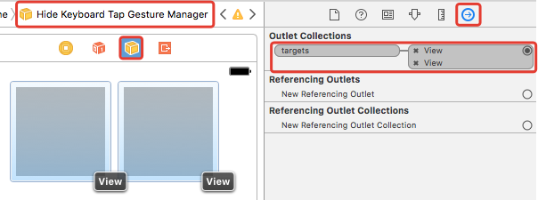
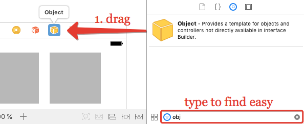
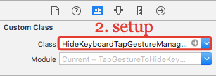
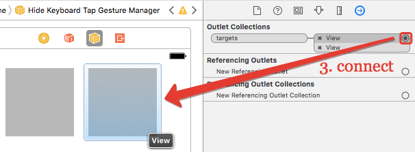
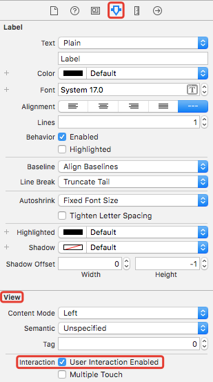

# HideKeyboardTapGestureManager


[](https://developer.apple.com/swift/)
[](https://cocoapods.org/)
[](https://github.com/Carthage/Carthage)
[](http://cocoadocs.org/docsets/HideKeyboardTapGestureManager)
[](http://mit-license.org/)

**HideKeyboardTapGestureManager** - easy to use, codeless manager to hide keyboard by tapping on views for iOS written in Swift.



## Structure

- [Features](#features)
- [Requirements](#requirements)
- [Installation](#installation)
	- [CocoaPods](#cocoapods)
	- [Carthage (code only)](#carthage-code-only)
	- [Manually](#manually)
- [Usage](#usage)
- [User Iteraction Enabled](#user-iteraction-enabled)
- [Code usage](#code-usage)
- [Xib support](#xib-support)
- [To do](#to-do)
- [License](#license)

## Features

- [x] 3 simple actions to setup
- [x] Multiple views setup
- [x] Codeless usage
- [x] Code only usage
- [x] Xib support
- [x] Warning logs for code usage

## Requirements

- Swift 3.0+
- iOS 8.0+

## Installation

### CocoaPods

```ruby
pod 'HideKeyboardTapGestureManager', '~> 1.0'
```

<details>
<summary>Full CocoaPods Guide (click to expand)</summary>

[CocoaPods](http://cocoapods.org) is a dependency manager for Cocoa projects. You can install it with the following command:

```bash
$ gem install cocoapods
```

To integrate HideKeyboardTapGestureManager into your Xcode project using CocoaPods, create file `Podfile` with content:

```ruby
platform :ios, '9.0'
use_frameworks!

target '<Your Target Name>' do
    pod 'HideKeyboardTapGestureManager', '~> 1.0'
end
```

Then, run the following command:

```bash
$ pod install
```

Close 'Your Target Name'.**xcodeproj** and open 'Your Target Name'.**xcworkspace**.

</details>

### Carthage (code only)

HideKeyboardTapGestureManager cannot be used in IB due `.framework` issue. See [Code usage](#Code-usage) section.

```ruby
github "bonyadmitr/HideKeyboardTapGestureManager" ~> 1.0
```

<details>
<summary>Full Carthage Guide (click to expand)</summary>

[Carthage](https://github.com/Carthage/Carthage) is a decentralized dependency manager that builds your dependencies and provides you with binary frameworks.

You can install Carthage with [Homebrew](http://brew.sh/) using the following command:

```bash
$ brew update
$ brew install carthage
```

To integrate **HideKeyboardTapGestureManager** into your Xcode project using Carthage, create file `Cartfile` with content:

```ruby
github "bonyadmitr/HideKeyboardTapGestureManager" ~> 1.0
```

Run `carthage update` to build the framework and drag the built `HideKeyboardTapGestureManager.framework` into your Xcode project.

</details>

### Manually

> If you prefer not to use either of the aforementioned dependency managers, you can integrate HideKeyboardTapGestureManager into your project manually.

Drag `HideKeyboardTapGestureManager` folder in your project

## Usage

- 1. Drag Object from Object library



- 2. Setup `HideKeyboardTapGestureManager` in Class field



 - 3. Connect views with `targets`



## User Iteraction Enabled

Target must be UIView subclass and user iteraction enabled is on. You can set it in IB in View section: (example for UILabel)



or in code:

```swift
someView.isUserInteractionEnabled = true
```

## Code usage

You can use **HideKeyboardTapGestureManager** in code:

Connect object:

```swift
@IBOutlet var hideKeyboardTapGestureManager: HideKeyboardTapGestureManager!
```

or add in code:

```swift
let hideKeyboardTapGestureManager = HideKeyboardTapGestureManager()
```

Add new targets:

```swift
hideKeyboardTapGestureManager.add(targets: [someView1])
```

or remove old ones:

```swift
hideKeyboardTapGestureManager.remove(targets: [someView2])
hideKeyboardTapGestureManager.removeAllTargets()
```

## Xib support

To use with xib you must add strong property to controller:

```swift
@IBOutlet var hideKeyboardTapGestureManager: HideKeyboardTapGestureManager!
```

> Otherwise it will be deinited. It is logic of Objects in xibs.

## To do

- [x] Add example
- [ ] Add tests
- [ ] Add comments
- [ ] Add CI

## License

HideKeyboardTapGestureManager is released under the MIT license. See [LICENSE](./LICENSE.md) for details.